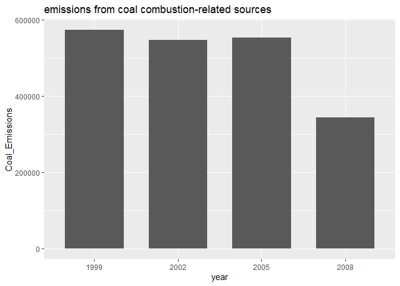

### Read Data

    library(tidyverse)

    ## -- Attaching packages ----------------------------------------------------------------------- tidyverse 1.2.1 --

    ## √ ggplot2 3.2.1     √ purrr   0.3.2
    ## √ tibble  2.1.3     √ dplyr   0.8.3
    ## √ tidyr   0.8.3     √ stringr 1.4.0
    ## √ readr   1.3.1     √ forcats 0.4.0

    ## -- Conflicts -------------------------------------------------------------------------- tidyverse_conflicts() --
    ## x dplyr::filter() masks stats::filter()
    ## x dplyr::lag()    masks stats::lag()

    NEI <- readRDS("summarySCC_PM25.rds")
    SCC <- readRDS("Source_Classification_Code.rds")

### Q1

Have total emissions from PM2.5 decreased in the United States from 1999
to 2008? Using the base plotting system, make a plot showing the total
PM2.5 emission from all sources for each of the years 1999, 2002, 2005,
and 2008.

    NEI_Yearly_Emiss_df <- NEI %>% group_by(year) %>% summarize(Total_Emissions=sum(Emissions))
    NEI_Yearly_Emiss <- NEI_Yearly_Emiss_df$Total_Emissions
    names(NEI_Yearly_Emiss) <- NEI_Yearly_Emiss_df$year

    options(scipen=7)
    par(mar=c(5,7,2,2), mgp=c(3.5,0.5,0))
    barplot(NEI_Yearly_Emiss,xlab='Year',ylab='Total Emissions',yaxt="n")
    axis(2, las=2, cex.axis=0.7)
    title('the total PM2.5 emission from all sources')

### Q2

Have total emissions from PM2.5 decreased in the Baltimore City,
Maryland (fips==“24510”) from 1999 to 2008? Use the base plotting system
to make a plot answering this question.

    NEI_Yearly_Emiss_df <- NEI %>% filter(fips == "24510") %>% group_by(year) %>% summarize(Total_Emissions=sum(Emissions))
    NEI_Yearly_Emiss <- NEI_Yearly_Emiss_df$Total_Emissions
    names(NEI_Yearly_Emiss) <- NEI_Yearly_Emiss_df$year

    options(scipen=7)
    par(mar=c(5,7,2,2), mgp=c(2.5,0.5,0))
    barplot(NEI_Yearly_Emiss,xlab='Year',ylab='Total Emissions',yaxt="n")
    axis(2, las=2, cex.axis=0.7)
    title('Baltimore City, Maryland')

### Q3

Of the four types of sources indicated by the type (point, nonpoint,
onroad, nonroad) variable, which of these four sources have seen
decreases in emissions from 1999?2008 for Baltimore City? Which have
seen increases in emissions from 1999?2008? Use the ggplot2 plotting
system to make a plot answer this question.

    NEI_Yearly_Emiss_df <- NEI %>% filter(fips == "24510") %>% group_by(year,type) %>% summarize(Total_Emissions=sum(Emissions))

    ggplot(NEI_Yearly_Emiss_df,aes(x=year,y=Total_Emissions))+geom_line(aes(color=type),size=1)+ggtitle('Baltimore City, Maryland')

### Q4

Across the United States, how have emissions from coal
combustion-related sources changed from 1999?2008?

    SCC_Coal_v <- SCC %>% filter(str_detect(EI.Sector,'Coal')) %>% pull(SCC)
    NEI_Coal_Emiss_df <- NEI %>% filter(SCC %in% SCC_Coal_v) %>% group_by(year) %>% summarize(Coal_Emissions=sum(Emissions)) %>%
        mutate(year=factor(year))

    ggplot(NEI_Coal_Emiss_df,aes(x=year,y=Coal_Emissions))+geom_bar(stat='identity',width=0.7)+
        ggtitle('emissions from coal combustion-related sources')

### Q5

How have emissions from motor vehicle sources changed from 1999?2008 in
Baltimore City?

    SCC_Vehi_v <- SCC %>% filter(str_detect(EI.Sector,'Vehicle')) %>% pull(SCC)
    NEI_Bal_Vehi_df <- NEI %>% filter(SCC %in% SCC_Vehi_v & fips=='24510') %>%
        group_by(year) %>% summarize(Bal_Vehi_Emissions=sum(Emissions)) %>% mutate(year=factor(year))

    ggplot(NEI_Bal_Vehi_df,aes(x=year,y=Bal_Vehi_Emissions))+geom_bar(stat='identity',width=0.7)+
        ggtitle('Emissions from motor vehicle sources in Baltimore City')

### Q6

Compare emissions from motor vehicle sources in Baltimore City with
emissions from motor vehicle sources in Los Angeles County, California
(fips==“06037”). Which city has seen greater changes over time in motor
vehicle emissions?

    SCC_Vehi_v <- SCC %>% filter(str_detect(EI.Sector,'Vehicle')) %>% pull(SCC)
    NEI_Vehi_df <- NEI %>% filter(SCC %in% SCC_Vehi_v & str_detect(fips,'24510|06037')) %>%
        group_by(fips,year) %>% summarize(Vehi_Emissions=sum(Emissions)) %>% ungroup() %>% 
        mutate(fips=recode(fips,'24510'='Baltimore','06037'='Los Angeles'), Vehi_Emissions=as.integer(Vehi_Emissions))

    ggplot(NEI_Vehi_df,aes(x=year,y=Vehi_Emissions))+geom_line(aes(color=fips),size=1)+
        ggtitle('Emissions from Vehicles in Baltimore and Los Angeles')

