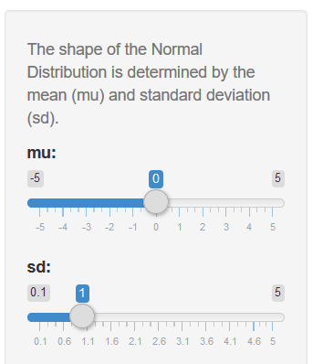
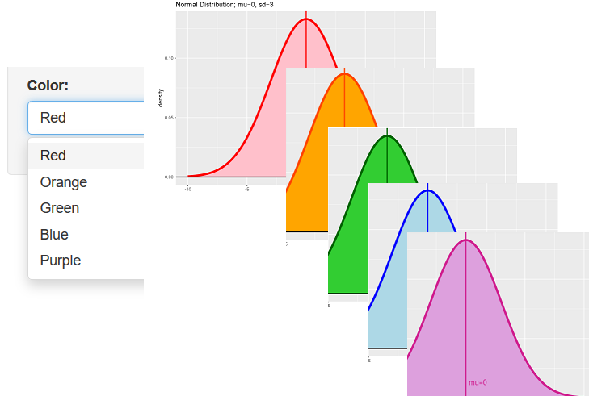
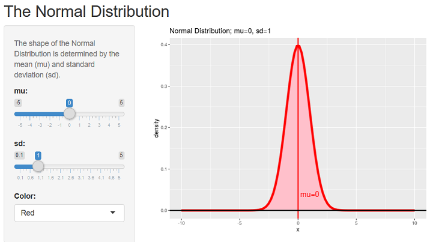

## ***Easy!***

*Just Set mu and sd by slide bar!*

## ***Colorful!***

*You can set color by pulldown list!*

## ***The Normal Distribution !***

https://hr-ishikawa.shinyapps.io/shinyapp/  <== *Click!*

 
The using function: "density <- dnorm(x, mu, sd)".

## ***Free!***

Thanks to:

https://www.r-project.org/

https://www.rstudio.com/

***and the contributors!***

