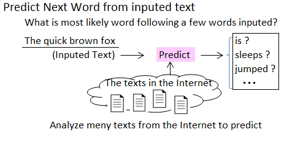
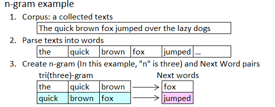
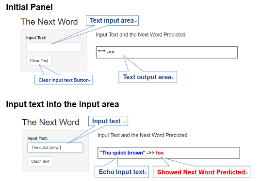

## 1. Goal

#### Predict Next word form inputed text

<br/>
<br/>
<div align="center">
<br/>
</div>


## 2. Model {.smaller}
### n-gram model

an "n-gram" is a contiguous sequence of "n" word from a given sample of text.  
We store the n-gram data and following word pairs. When the last "n" words of inputed text is match any n-gram, the next word provably the word paird.

<div align="center">
<br/>
</div>

We create three n-gram models that "n" is  one, two and three. Apply tri(three)-gram to The text inputed preferentially, when no match, back-off to lower model.

## 3. The Prototype

#### Instruction

<div align="center">
<br/>
</div>

[Shiny_predict_next_word](https://hr-ishikawa.shinyapps.io/Shiny_predict_next_word/)  <== *Click to Try!*


## 4. Sources

### Data files

```
     - en_US.blogs.txt   -     899,288 Sentences
     - en_US.news.txt    -   1,010,242 Sentences
     - en_US.twitter.txt -   2,360,148 Sentences
     -             extraced 95,403,497 words
```
### Source Codes
<br/>
[Create ngram data set](https://hr-ishikawa.github.io/coursera/DataScienceSpecialization/10_Data_Science_Capstone/Final_Project/Final_Project_Create_ngram.html)

[Shiny_App.md](https://github.com/hr-ishikawa/coursera/blob/master/DataScienceSpecialization/10_Data_Science_Capstone/Final_Project/Shiny_App.md)

## 5. Improvement

1. Reduse Data size to load faster
This implementation it takes time to load the data file. So, we can reduce physical data size without changing the logical model. For example, convert words to index or hash numbers.
<br/>
2. Predict more likely word
We can consider to predict words with more likely. For example, word frequency, word position, tense, plural form, substring and (more advanced) strength or closeness of meaning, and more.