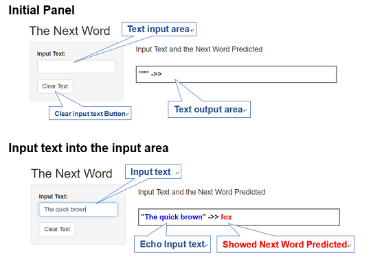

## 1. Objective

#### Predict Next word form inputed text

## 2. The Model {.smaller}
### n-gram model

an "n-gram" is a contiguous sequence of "n" word from a given sample of text.  
We store the n-gram data and following word pairs. When the last "n" words of inputed text is match any n-gram, the next word provably the word paird.

We create three n-gram models that "n" is  one, two and three. Apply tri(three)-gram to The text inputed preferentially, when no match, back-off to lower model.

## 3. The Prototype

[Shiny_predict_next_word](tahttps://hr-ishikawa.shinyapps.io/Shiny_predict_next_word/)  <== *Click!*

#### Instruction

 

## 4. Sources

### Data files

- en_US.blogs.txt   -     899,288 Sentences
- en_US.news.txt    -   1,010,242 Sentences
- en_US.twitter.txt -   2,360,148 Sentences
- extraced 95,403,497 words

### Source Code  

[Create ngeam data set](https://hr-ishikawa.github.io/coursera/DataScienceSpecialization/10_Data_Science_Capstone/Final_Project/Final_Project_Create_ngram.html)

[Shiny_App.md](https://github.com/hr-ishikawa/coursera/blob/master/DataScienceSpecialization/10_Data_Science_Capstone/Final_Project/Shiny_App.md)

## 5. Improvement

1. Reduse Data size: This implementation it takes time to load the data file. So, reduce physical data size without changing the logical model. For example, convert words to index or hash numbers

2. predict more likely word: 

